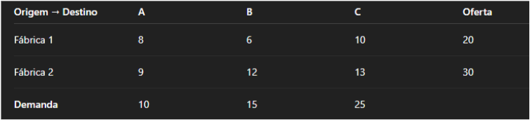
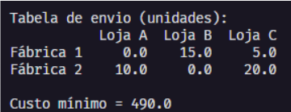

# Trabalho Algoritmo de Minimização

Minimização de Custos de Transporte com Programação Linear

## Descrição

O problema de transporte é uma aplicação clássica de Programação Linear (PL), onde o objetivo é minimizar o custo total de envio de produtos entre pontos de origem (fábricas) e pontos de destino (lojas/centros de distribuição), respeitando as restrições de oferta e demanda.

Neste caso, usaremos o método Simplex por meio do solver CBC (Coin-or Branch and Cut) para encontrar a melhor solução, lendo o modelo e tentando minimizar a função objetivo respeitando as restrições.

## Funcionalidades

### Variáveis de decisão:

Definimos as variáveis como a quantidade de produtos transportados de cada fábrica para cada loja:

- x1A, x1B, x1C → Envios da Fábrica 1 para as Lojas A, B e C.
- x2A, x2B, x2C → Envios da Fábrica 2 para as Lojas A, B e C.

Regras:

- Fábrica 1: pode enviar somente 20 unidades para as 3 lojas (A, B e C).
- Fábrica 2: pode enviar somente 30 unidades para as 3 lojas (A, B e C).

Cada loja precisa receber exatamente a quantidade necessária:
(fábrica 1 + fábrica 2):

- Loja A: x1A + x2A = 10
- Loja B: x1B + x2B = 15
- Loja C: x1C + x2C = 25

### Tabela

- Os números 8, 6, 10, 9, 12 e 13 são custo de enviar 1 unidade.
- A oferta é quanto cada fábrica tem disponível.
- A demanda é quanto cada loja precisa receber.

### Resultado do Solver

- A Fábrica 1: Enviou 0 para A, 15 para B, 5 para C → total enviado = 20 (igual à oferta)
- A Fábrica 2: Enviou 10 para A, 0 para B, 20 para C → total enviado = 30 (igual à oferta)

### Função objetivo (minimizar custo):

Min = (8 \* x1A) + (6 \* x1B) + (10 \* x1C) + (9 \* x2A) + (12 \* x2B) + (13 \* x2C)

### Substituindo os valores do resultado:

Fábrica 1:  
8 × 0 = 0  
6 × 15 = 90  
10 × 5 = 50  
Subtotal Fábrica 1 = 0 + 90 + 50 = 140

Fábrica 2:  
9 × 10 = 90  
12 × 0 = 0  
13 × 20 = 260  
Subtotal Fábrica 2 = 90 + 0 + 260 = 350

Custo total = 140 + 350 = 490

## Complexidade do Algoritmo

O método Simplex move de vértice em vértice dentro de um poliedro (uma forma geométrica multidimensional), buscando o caminho até o ótimo.

### O que ele faz:

- Começa em um canto (solução inicial viável)
- Vai andando de vértice em vértice
- Só se move se o custo melhorar
- Para quando não dá mais pra melhorar (ótimo encontrado).

### A complexidade do algoritmo para o melhor caso do Big O:

**Melhor caso: O(1)**  
Como contém valores bem menores e definidos, o Simplex resolve rapidamente:  
2 fábricas, 3 centros = 2 \* 3 = 6 total de possibilidades de encontrar o melhor valor.

**Pior caso O(2^n)**  
No pior caso do algoritmo seria quando contém valores muito grandes e teria que percorrer todos para encontrar o melhor valor.  
x1A, x1B, x1C, x2A, x2B, x2C (6 vértices das combinações possíveis)  
O(2^n) = O(2^6) = 64 vértices possíveis.

Mesmo sendo pequeno, o Solver consegue resolver rápido. E se fosse 10 fábricas e 20 centros → 200 variáveis → 2^200 seria absurdamente grande.

## Conclusão

O problema de transporte foi modelado como um programa linear de minimização, mostrando como distribuir os produtos de forma eficiente para atender a demanda das lojas com o menor custo possível.

### Trabalho desenvolvido por:

**Grupo**:

- [Beatriz Alves](https://www.linkedin.com/in/beatriz-alves-de-souza-789a84239/)
- [Bianca Mayra](https://www.linkedin.com/in/bianca-mayra-de-assisaguiar-8b18b0235/)
- [Lucelho Silva](https://www.linkedin.com/in/lucelhosilva/)
- [Renato Noronha](https://www.linkedin.com/in/renatonoronha/)
- [Túlio Inácio](https://www.linkedin.com/in/t%C3%BAlio-in%C3%A1cio-767244276/)

Data: **07 de outubro de 2025**

## Docente do Projeto

Edyene Oliveira
